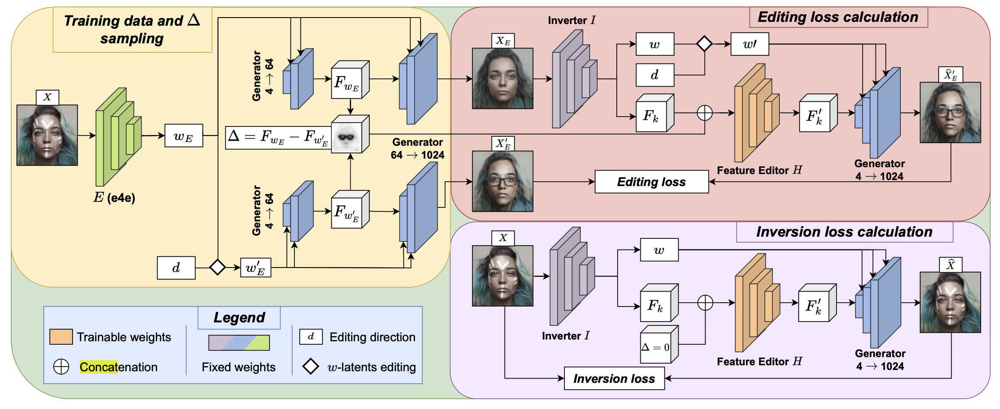
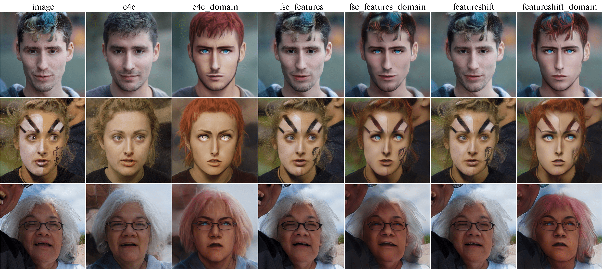
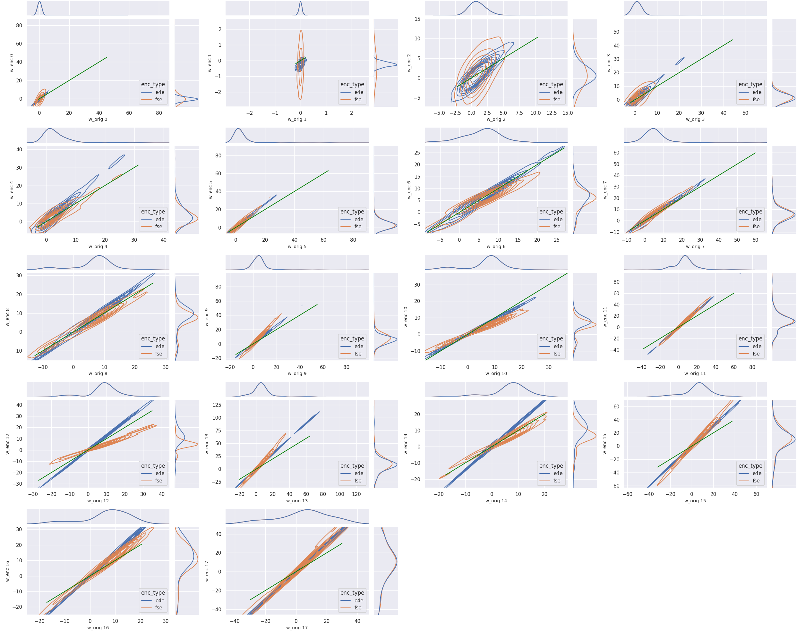
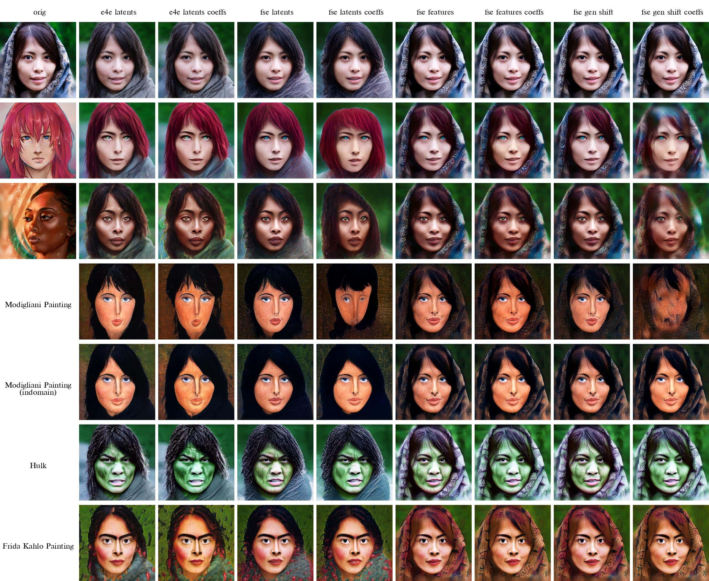

# Developing effective StyleGAN encoders for domain adaptation
## Under the guidance of A.Alanov and M.Nakhodonov
### This is my undergraduate thesis at HSE and AIRI, the final text is in the [sedov-hse-thesis.pdf](sedov-hse-thesis.pdf)!

### Initially we were working on the [StyleDomain repository](https://github.com/FusionBrainLab/StyleDomain)

Starting from the [StyleDomain paper](https://arxiv.org/abs/2212.10229) results, 
we have focused on the improvement of interaction between the StyleSpace domain adaptation method and StyleGAN encoders,
such as [Encoder-4-Editing](https://arxiv.org/pdf/2102.02766) and [Feature-Style-Encoder](https://arxiv.org/abs/2202.02183).

### FeatureShift Encoder

As the result, we have trained the FeatureShift domain encoder that unites knowledge of pretrained StyleSpace weights over 70 domains 
and improves reconstruction/adaptability trade-off being used along with more accurate Feature-Style-Encoder. We used the concurrently released [StyleFeatureEditor](https://arxiv.org/abs/2406.10601) as the baseline for our encoder architecture, though it was initially designed for the editing tasks. 

####  [StyleFeatureEditor](https://arxiv.org/abs/2406.10601) architecture from the concurrently released paper:

We proposed a new Domain Inversion Loss component to complement the broader structure of domains, which turned to be a useful component for the quality / adaptability balance control. For the increasing number of domains setting our model supports two types of feature-level regularisations, which stabilises the training process further more. The final results of our methods on the sample domain are presented in the last column of the above image grid, showing much better results comparing to E4E and FSE adaptations in the 3-rd and 5-th columns, respectively. You can check the main thesis paper for metrics comparisons and further considerations on this method.

#### FeatureShift domain adaptation results comparing to E4E and FSE:

### Enhancing Domain Adaptation
We mentioned specific shifts of per-channels distributions of each layer for both E4E and FSE, which interfered with the outcomes of the StyleDomain method. Being highly non-correlated on the first layers, they shift in the specific way afterwards, which provides evidence for the empricial choices of feature interference layer in the previous works, Feature-Style-Encoder in particular.

#### Mean Latent Per-Channel Distributions of each StyleGAN layer compared between E4E / FSE and original latents:

We proposed a simple yet effective way to calibrate domain adaptation effect according to encoder distributions without retraining the latter ones. The results of our enhancement are presented in the following image grid. The 3-rd and 7-th columns demonstrate adaptability improvements comparing to the original E4E and FSE adaptations in the 2-nd and 6-th columns respectively. Moreover, the 5-th and 9-th columns correspond to additional FSE utilisations that include information from the first-layer latents. We show that these layers fail to perform along with the correctly-rescaled domain shifts, which explains the choice of the original FSE architecture in more detail. 

#### Domain adaptation enhancment by learned per-channel rescaling factors for each encoder architecture:

